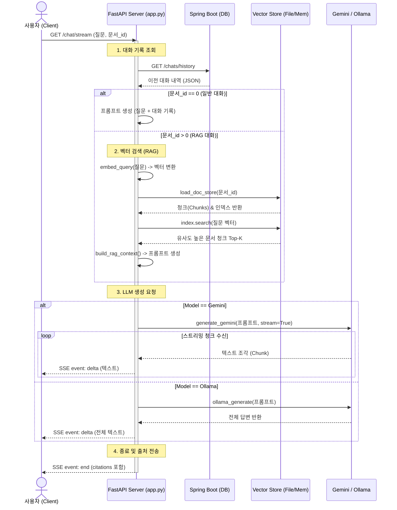
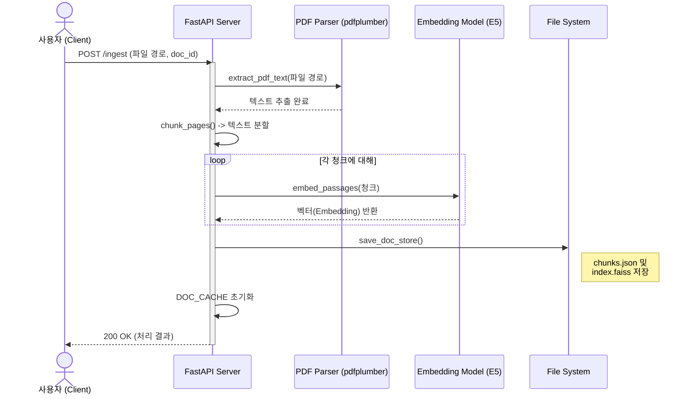

## ChatBot프로젝트 
# 한줄요약
---
### 로컬 자원의 한계를 극복하는 고효율 RAG 기반 AI 서비스: Sliding Window와 SSE를 통한 응답 성능 최적화

# 🚀 FastAPI RAG & Hybrid LLM Backend

이 프로젝트는 **FastAPI**를 기반으로 구축된 **RAG(검색 증강 생성)** 챗봇 백엔드 서버입니다. PDF 문서를 분석하여 벡터 데이터베이스(FAISS)에 저장하고, 사용자의 질문에 대해 **Google Gemini** 또는 **Local Ollama** 모델을 사용하여 답변을 생성합니다.


## 프로젝트 동기

- 생성형 AI 서비스의 고질적인 성능 저하 해결: 생성형 모델을 사용하며 대화가 누적될수록 응답 속도가 현저히 느려지는 문제를 백엔드 아키텍처 관점에서 해결하고자 시작한 프로젝트입니다.

- 제한된 로컬 인프라 환경의 최적화: 고가의 GPU 서버가 아닌 로컬 모델 환경에서 발생할 수 있는 하드웨어적 제약을 소프트웨어적인 알고리즘 최적화를 통해 극복하는 데 목적을 두었습니다.

- 사용자 경험 중심의 설계: 단순히 기술 구현에 그치지 않고, 사용자가 체감하는 버벅임을 실질적으로 줄이기 위해 비동기 파이프라인과 스트리밍 통신을 도입하여 최적의 대화형 인터페이스를 구축하고자 했습니다.

## 핵심 성과

- 응답 성능 최적화: SSE 기반 스트리밍 도입으로 첫 응답 체감 시간을 11초에서 7초로 약 36% 단축.
- 비용 및 효율 개선: Sliding Window 알고리즘 적용으로 전체 대화 이력 전송 대비 추론 지연 및 토큰 사용량 약 20% 절감.

## 📚 주요 기능 (Key Features)

### 1. RAG (Retrieval-Augmented Generation) 시스템
- **PDF 문서 처리**: `pdfplumber`를 사용하여 PDF 텍스트를 추출하고, 의미 단위로 청킹(Chunking)합니다.
- **벡터 검색**: `intfloat/multilingual-e5-base` 모델을 사용하여 임베딩을 생성하고, **FAISS**를 통해 고속 유사도 검색을 수행합니다.
- **검색 최적화**: E5 모델의 특성에 맞춰 `query:`와 `passage:` 접두어(Prefix) 전략을 사용하여 검색 정확도를 높였습니다.

### 2. 하이브리드 LLM 아키텍처
- **Google Gemini**: 복잡한 추론이 필요하거나 고성능이 필요한 경우 `gemini-2.5-flash` 모델을 사용합니다.
- **Local Ollama**: 로컬 환경에서 `qwen3-vl:8b` 모델을 사용하여 비용 효율적이고 프라이버시가 보장되는 답변을 생성합니다.

### 3. 실시간 스트리밍 (SSE)
- Server-Sent Events (SSE)를 구현하여 LLM이 생성하는 답변을 실시간으로 클라이언트에 전송합니다 (`/chat/stream`).
- 사용자 경험(UX)을 위해 답변 생성 지연 시간을 최소화했습니다.

### 4. 대화 맥락 유지 (Context Awareness)
- 외부 **Spring Boot** 서버와 연동하여 이전 대화 기록을 조회하고, 이를 프롬프트에 포함하여 문맥에 맞는 답변을 제공합니다.

---

## 🛠 기술 스택 (Tech Stack)

- **Language**: Python 3.10+
- **Web Framework**: FastAPI, Uvicorn,SpringBoot
- **AI & ML**:
  - `sentence-transformers` (Embedding)
  - `faiss-cpu` (Vector Store)
  - `google-generativeai` (Gemini SDK)
- **Data Processing**: `pdfplumber`, `numpy`

---

## 🚀 시작하기 (Getting Started)

### 1. 환경 변수 설정
프로젝트 루트에 `.env` 파일을 생성하거나 환경 변수를 설정하세요.

```bash
export GEMINI_API_KEY="your_api_key_here"
```

### 2. Ollama 모델 설치 (로컬 모델 사용 시)
Ollama가 설치되어 있어야 하며, 코드에서 사용하는 모델을 pull 해야 합니다.

```bash
ollama pull qwen3-vl:8b
```

### 3. 패키지 설치

```bash
pip install -r requirements.txt
```
*(참고: `requirements.txt`에는 fastapi, uvicorn, sentence-transformers, faiss-cpu, google-generativeai, pdfplumber 등이 포함되어야 합니다.)*
만약 안되면 py에서 안되는 import 찾아서 설치해주세요

### 4. 서버 실행

```bash
python app.py
```
---

## 📡 API 명세 (API Endpoints)

### 1. 문서 적재 (Ingest)
- **URL**: `POST /ingest`
- **설명**: PDF 파일을 읽어 텍스트를 추출하고 벡터 인덱스를 생성하여 저장합니다.
- **Body**:
  ```json
  {
    "document_id": [1],
    "file_path": "data/sample.pdf"
  }
  ```

### 2. 채팅 스트리밍 (Chat Stream)
- **URL**: `GET /chat/stream`
- **Query Params**: `docIds` (문서 ID), `q` (질문), `model` (gemini/ollama)
- **설명**: SSE를 통해 실시간으로 답변을 스트리밍합니다. `docIds=0`일 경우 일반 대화, 그 외에는 RAG 모드로 동작합니다.

### RAG 채팅 스트리밍 시퀀스 다이어그램



### 문서 임베딩 시퀀스 다이어그램




