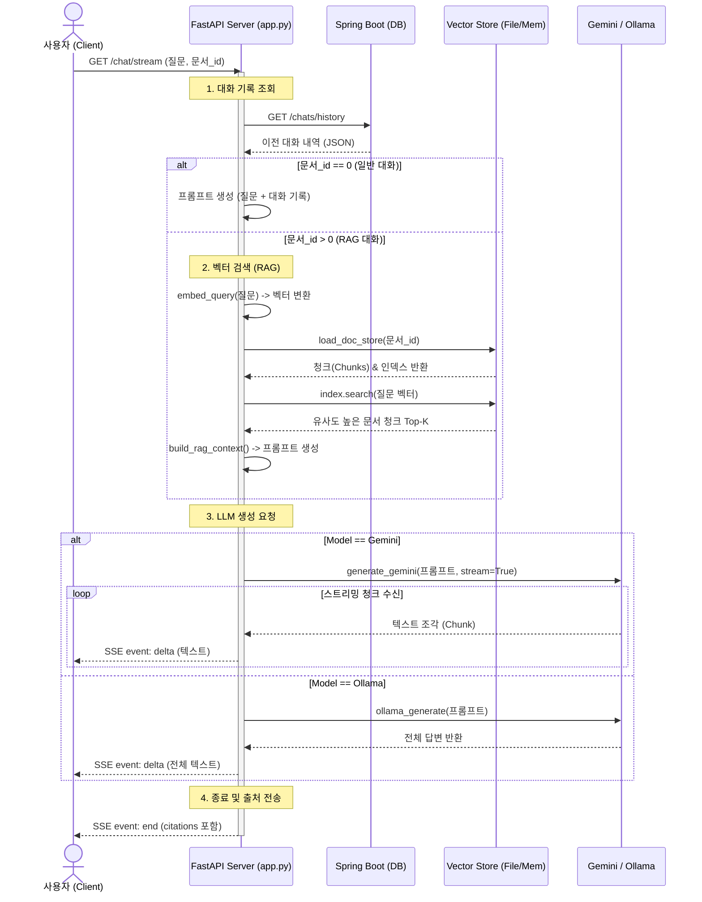

## 챗봇 만드는 1인 프로젝트 입니다. 

### RAG 채팅 스트리밍 시퀀스 다이어그램



### 문서 임베딩 시퀀스 다이어그램

```mermaid
sequenceDiagram
    actor User as 사용자 (Client)
    participant API as FastAPI Server
    participant PDF as PDF Parser (pdfplumber)
    participant Model as Embedding Model (E5)
    participant Disk as File System

    User->>API: POST /ingest (파일 경로, doc_id)
    activate API
    
    API->>PDF: extract_pdf_text(파일 경로)
    PDF-->>API: 텍스트 추출 완료
    
    API->>API: chunk_pages() -> 텍스트 분할
    
    loop 각 청크에 대해
        API->>Model: embed_passages(청크)
        Model-->>API: 벡터(Embedding) 반환
    end
    
    API->>Disk: save_doc_store()
    Note right of Disk: chunks.json 및<br/>index.faiss 저장
    
    API->>API: DOC_CACHE 초기화
    
    API-->>User: 200 OK (처리 결과)
    deactivate API


